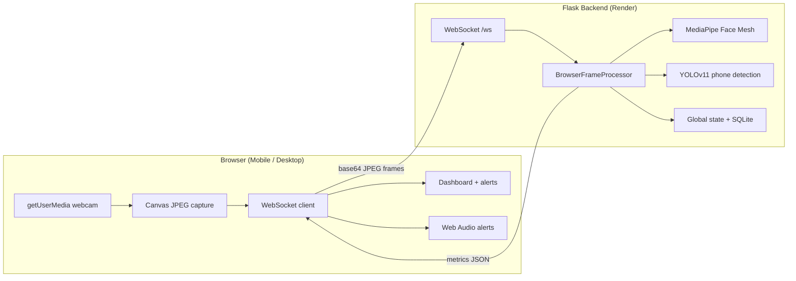

# AI Driver Monitoring and Alert System

Browser-first driver monitoring for cloud deployment. The camera runs in the user's browser (phone, tablet, or desktop); frames are sent to the Flask backend over WebSocket for AI analysis. No server-side webcam access is required, so the app works on Render and other cloud hosts.

## Architecture



### Components

| Layer | File | Role |
|-------|------|------|
| Entry | `app.py` | Flask app, WebSocket registration, Gunicorn target |
| Transport | `routes/websocket.py` | Receives browser frames, returns metrics |
| Processing | `engine/camera.py` | `BrowserFrameProcessor` — decode JPEG, queue, analyze |
| Face AI | `engine/face_analyzer.py` | EAR/MAR drowsiness, yawning, head pose |
| Phone AI | `engine/phone_detector.py` | YOLOv11 cell-phone detection |
| Risk | `engine/risk.py` | Attention score and risk level |
| State | `engine/state.py` | Thread-safe telemetry for REST API |
| Data | `database.py` | SQLite sessions, events, alerts |
| Frontend | `static/js/main.js` | Camera capture, WebSocket, audio alerts, dashboard polling |
| UI | `templates/` | Live monitor, dashboard, analytics, reports |

### Detection pipeline (per frame)

1. Browser captures webcam frame as JPEG (scaled for bandwidth).
2. Frame sent over WebSocket to `/ws`.
3. Backend decodes with OpenCV (`imdecode` only — no `VideoCapture`).
4. MediaPipe analyzes face: eye closure, yawning, head pose.
5. YOLO runs every N frames for phone usage.
6. Risk engine computes attention score and alert list.
7. Metrics JSON returned to browser; dashboard and audio update in real time.

## Local development

### Requirements

- Python 3.11+
- Modern browser with camera support (Chrome, Safari, Firefox, Edge)
- HTTPS or `localhost` for camera permissions

### Setup

```bash
python -m venv venv
venv\Scripts\activate        # Windows
# source venv/bin/activate   # macOS/Linux

pip install -r requirements.txt
python app.py
```

Open `http://127.0.0.1:5000/live`, click **Start Monitoring**, and allow camera access.

YOLO weights (`yolo11n.pt`) are downloaded automatically on first run if not present locally.

## Deploy to Render

### 1. Push to GitHub

Ensure the repository is connected to Render.

### 2. Create a Web Service

Use the included `render.yaml` blueprint, or configure manually:

| Setting | Value |
|---------|--------|
| **Runtime** | Python 3.11 |
| **Build command** | `pip install -r requirements.txt` |
| **Start command** | `gunicorn --worker-class gevent --workers 1 --bind 0.0.0.0:$PORT --timeout 120 --keep-alive 5 app:app` |
| **Health check path** | `/api/health` |

### 3. Environment variables

| Variable | Value | Notes |
|----------|--------|-------|
| `PYTHON_VERSION` | `3.11.9` | Matches `runtime.txt` |
| `FLASK_DEBUG` | `0` | Production |

### 4. Important Render notes

- **WebSockets**: Enabled by default on Render web services. The app uses `wss://` when served over HTTPS.
- **No webcam on server**: All camera access is in the browser — this is intentional.
- **Single worker**: Use `--workers 1` so in-memory state and model loading stay consistent.
- **Gevent worker**: Required for WebSocket support with Gunicorn.
- **Plan**: Starter or higher recommended (YOLO + MediaPipe need CPU/RAM).
- **First request**: Model download may add latency on cold start.

### 5. Mobile usage

1. Open your Render URL on Android or iPhone (HTTPS required).
2. Go to **Live Monitor**.
3. Tap **Start Monitoring** and allow camera access.
4. Keep the tab visible for best performance; capture pauses when the tab is hidden.

## API endpoints

| Method | Path | Description |
|--------|------|-------------|
| GET | `/api/health` | Health check for Render |
| GET | `/api/live` | Current telemetry from active session |
| GET | `/api/stats` | Event counts |
| GET | `/api/events` | Recent events |
| GET | `/api/risk` | Current risk score/level |
| WS | `/ws` | Frame upload + real-time metrics |

## Legacy cleanup

The old `dashboard/app.py` MJPEG / `VideoCapture(0)` stack has been removed. Use `app.py` at the project root as the only entry point.

## Troubleshooting

| Issue | Fix |
|-------|-----|
| Camera blocked | Use HTTPS; grant permission after tapping Start |
| WebSocket disconnects | Check Render logs; ensure gevent worker is used |
| Slow inference | Lower client FPS automatically adapts; upgrade Render plan |
| No phone detection | YOLO downloads on first run; allow outbound network on build |
